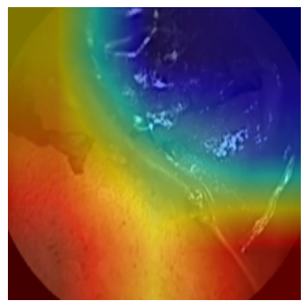
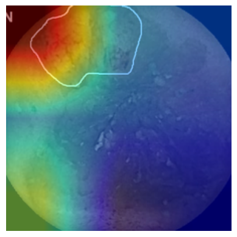
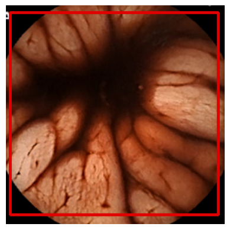
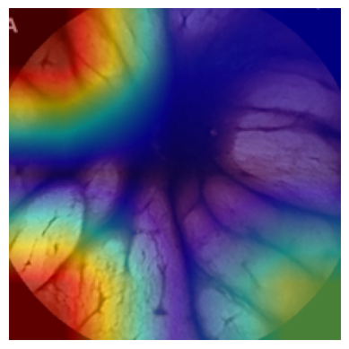
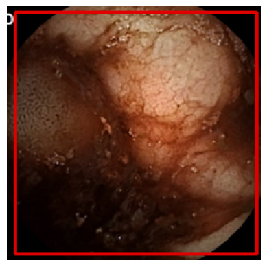

# ColonNet
ColonNet is a Deep Learning Model that detects and highlights the instances of bleeding in the Gastrointestinal Tract. 

This project is a submission for The Auto-WCEBleedGen Challenge Ver2 by **Team ColonNet**.

## Network Architecture

The Neural Network consists of three branches for classification , segmentation and bounding box prediction.

### Classification & Bounding Box Prediction Branch

- DenseNet121 is used to extract features from the input image. This output is Maxpooled and flattened to pass into the classification branch.For the bounding box 
  branch, the output is Averagepooled and flattened.

- The classification branch consists of 5 fully connected layer connected by ReLU activation function. Dropout layers of 0.3 and 0.2 are implemented after first and
  second layer. Sigmoid Function is applied on the final layer which has only 1 node.

- The bounding box prediction branch consists of 6 fully connected layers connected by ReLU and ELU activation function. Dropout layer of 0.3 is implemented after 
  4th layer. Sigmoid Function is applied on the final layer to crunch the values of the coordinates between 0 and 1.

### Segmentation Branch

For Semantic Segmentation we have employed the traditional UNet architecture with Batch Normalization and ConvTranspose layers. It comprises of an Encoder path and a Decoder path which generates segmenation masks.

## Loss Functions

- Classification Branch - **Binary Cross Entropy Loss**
- Bounding Box Prediction Branch - **Mean Squared Error Loss**
- Segmentation Branch - **focal tversky Loss**

## Training Pipeline

**AdamW** Optimizer is used for training classification and bounding box branches and **Adam** optimizer is used for training segmentation branch.

1. We trained the Bounding Box branch for 10 epochs by feeding only bleeding images to the model. This resulted in **0.1806** validation loss.
2. Next we froze the parameters for the bounding box branch and the DenseNet and trained the model again for 10 epochs this time with the entire training dataset including non-bleeding images. At the end the validation loss for classification was **0.001**.
3. For segmentation branch, again only bleeding images were passed to the model for 30 epochs. The best validation loss obtained was **0.28**.

## PREDICTIONS

### VALIDATION DATASET 

| Bounding Box Prediction | CAM PLOT | Segmentation Mask |
| --- | ---- | --- |
|  |  |  |
|  |  |  |
|  |  |  |
|  |  |  |
|  |  |  |

### TEST DATASET 1

| Bounding Box Prediction | CAM PLOT | Segmentation Mask |
| --- | ---- | --- |
|  |  |  |
|  |  |  |
|  |  |  |
|  |  |  |
|  |  |  |

### TEST DATASET 2

| Bounding Box Prediction | CAM PLOT | Segmentation Mask |
| --- | ---- | --- |
|  |  |  |
|  |  |  |
|  |  |  |
|  |  |  |
|  |  |  |

## HOW TO USE
First make sure that your folder structure looks like the tree shown below

Then install the requirments given in the **requirements.txt**

To train the model yourself you can simply run the **training.py**

To simply make predictions on images,run **prediction.py** and give the image path when asked. (You can also just give the image name but the image should be in the **same folder** as predictions.py)

## CREDITS

We wish to thank all the members of MISAHUB for organizing this challenge and providing the relevant image dataset for the training and testing of this model.

For further information and model metrics kindly refer to the README.pdf and excel file.
